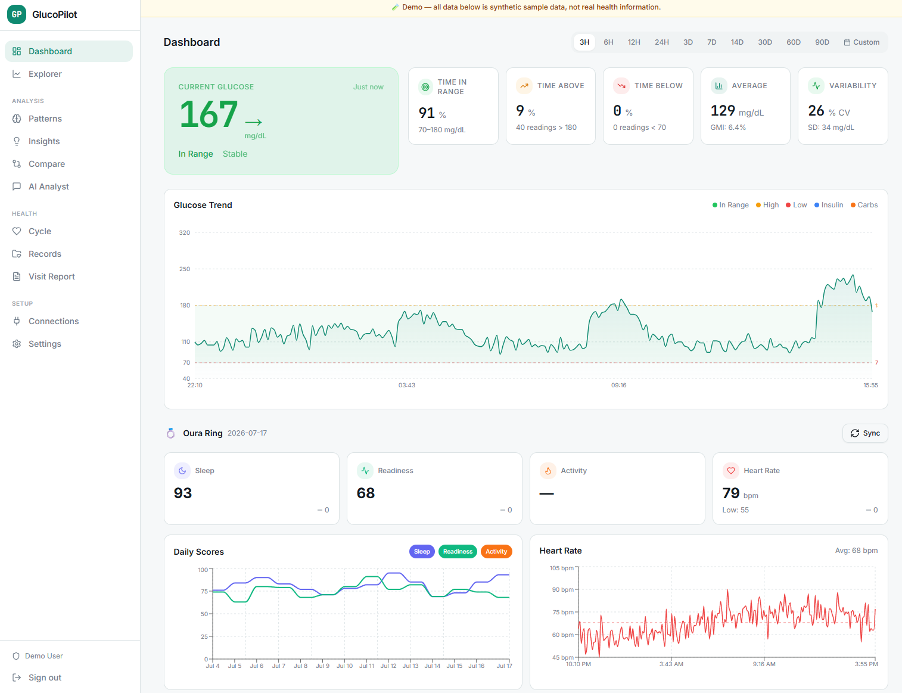
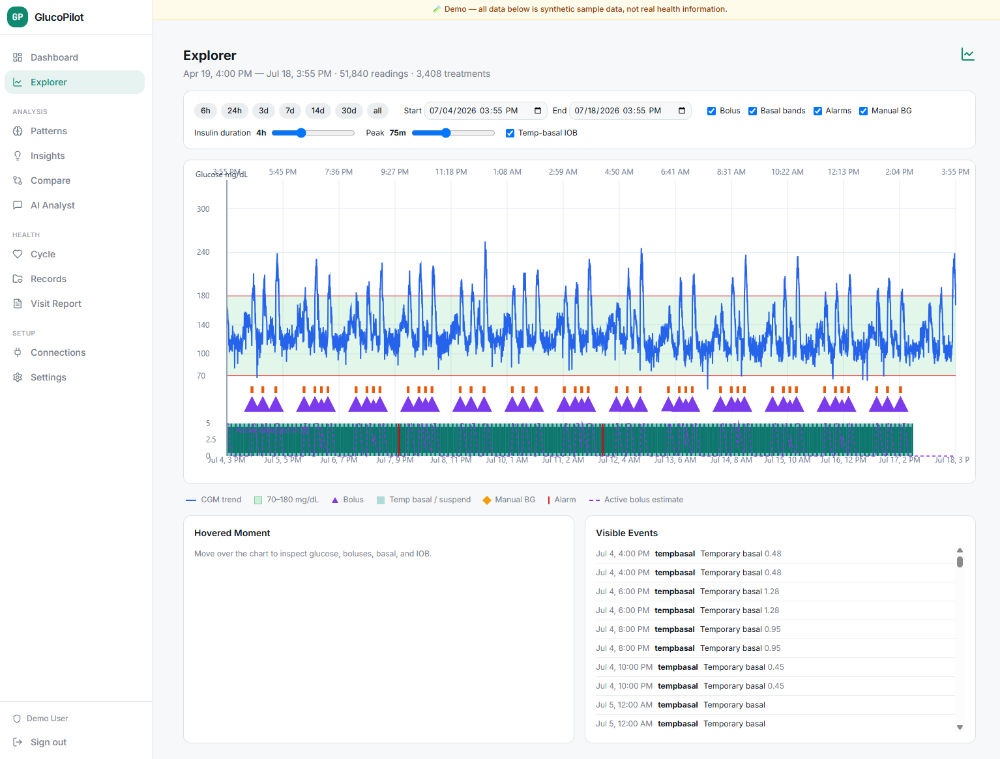
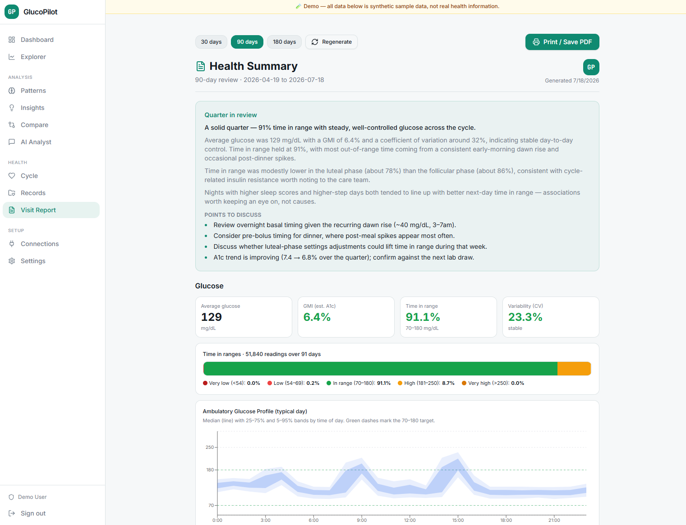
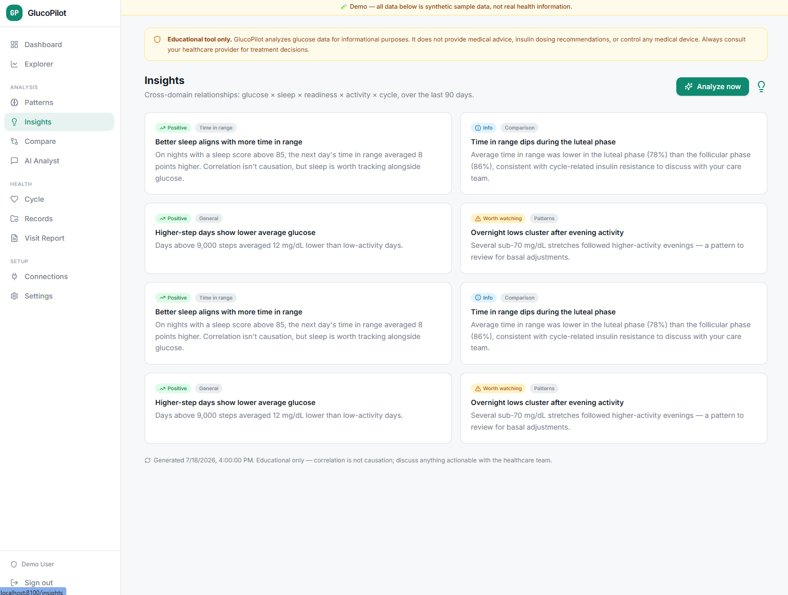
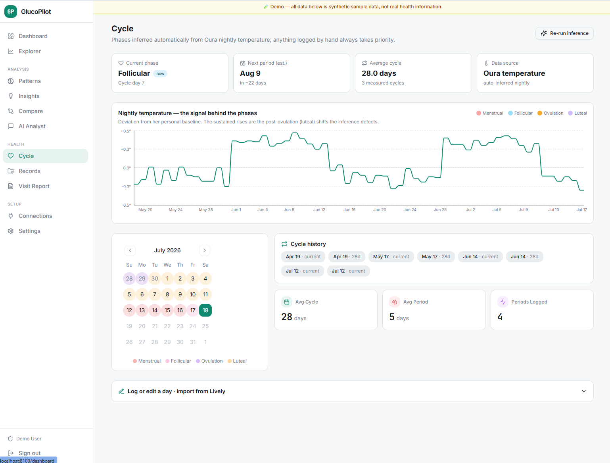
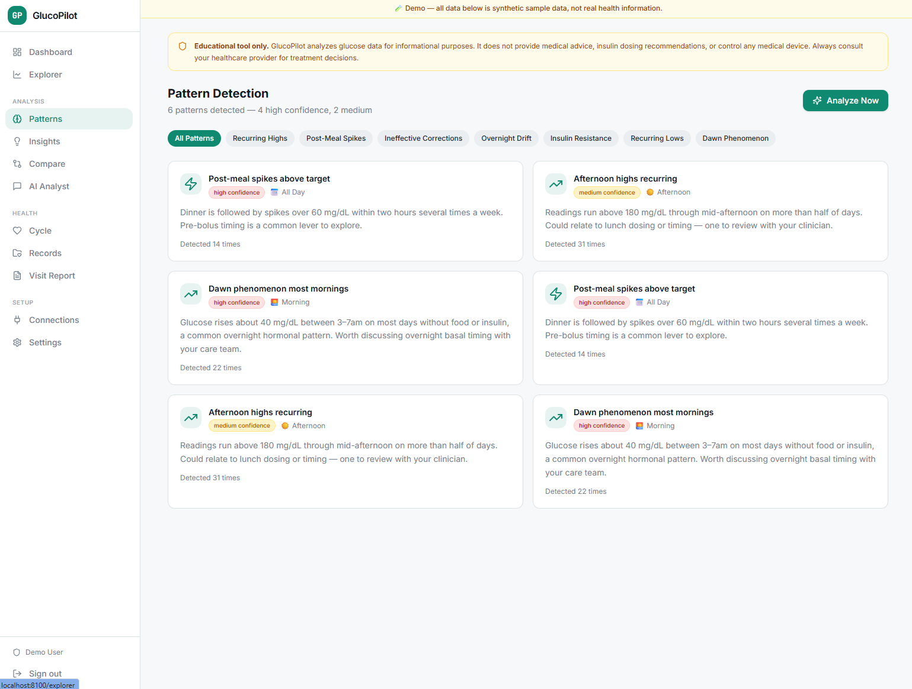
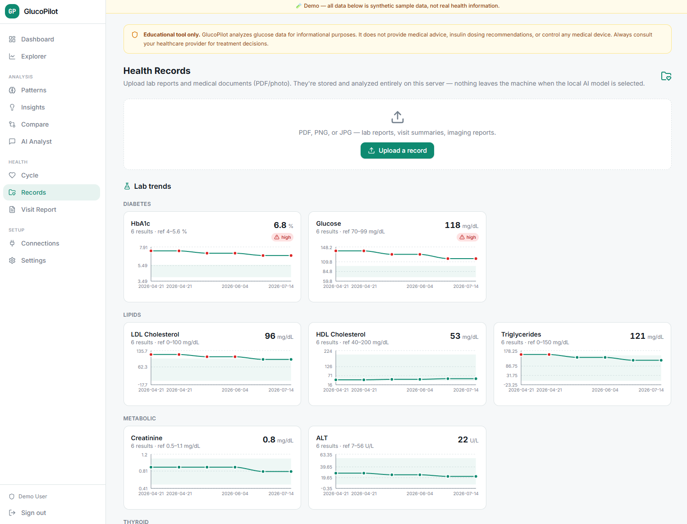

# GlucoPilot

[](https://github.com/Paco5687/GlucoPilot/actions/workflows/ci.yml)
[](LICENSE)

A self-hosted, single-user personal health platform centered on Type 1 diabetes.
It unifies continuous glucose monitoring, insulin pump data, wearables, menstrual
cycle tracking, and lab work into one private app — with analysis, AI narratives,
a printable clinician report, and a read-only login to share with a doctor.

Everything runs on **your** server with **your** API keys. With a local model,
no health data ever leaves the machine.

> **Not a medical device.** GlucoPilot is for personal data exploration and
> education. It does not diagnose, recommend insulin dosing, or control any
> device. Always consult your care team for treatment decisions.



<sub>Screenshots use the built-in demo's synthetic data — no real health information.</sub>

## What it does

**Data sources** (each connected from the in-app Connections page):

| Source | Data | Notes |
|---|---|---|
| **Dexcom Share** | real-time glucose | the follower feed; near-live |
| **Dexcom API v3** | historical glucose + events | official API, ~1 h delay |
| **Nightscout** | glucose + treatments + profile | if you run one |
| **Tandem Source** | pump boluses / basal / suspends | t:slim X2 & Mobi, via `tconnectsync` |
| **Glooko** | pump treatments | Tandem & Omnipod 5 fallback |
| **Oura Ring** | sleep / readiness / HRV / HR / SpO₂ / temperature | OAuth |
| **Fitbit** | steps / resting HR / sleep / SpO₂ / breathing rate | OAuth |
| **CSV / Base44 export** | bulk import | glucose, treatments, Oura, cycle |

**Features:**

- **Dashboard** — real-time glucose, TIR/GMI/CV metrics, AGP, treatment timeline, wearable overlays.
- **Explorer** — a zoomable/pannable canvas chart of glucose with insulin, basal bands, and IOB estimation.
- **Patterns** — statistical + AI detection of recurring highs/lows, post-meal spikes, dawn phenomenon, etc.
- **Insights** — cross-domain correlations: glucose × sleep × readiness × activity × cycle.
- **Cycle** — menstrual phases **inferred automatically from Oura nightly temperature**, tied to glucose/insulin.
- **AI Analyst** — chat grounded in your own computed glucose data.
- **Records** — upload lab reports (PDF/photo); a local vision model extracts values into **per-analyte trend charts**.
- **Visit Report** — a printable 90-day clinical summary (AGP, TIR, per-phase metrics, labs) with an AI "quarter in review" narrative.
- **Provider login** — a read-only second account to share with a clinician.

## Try the demo

Spin up a throwaway instance seeded with realistic **synthetic** data (no login,
no real health info) to explore every feature:

```bash
docker compose -f docker-compose.demo.yml up -d --build
# then open http://localhost:8100
```

The demo auto-seeds ~90 days of glucose, treatments, wearables, cycle, and labs.
Never enable `DEMO_MODE` on an instance holding real data — it skips login.

## Screenshots

| Explorer — zoomable glucose + insulin | Visit Report — printable clinician summary |
|:---:|:---:|
| [](docs/screenshots/explorer.png) | [](docs/screenshots/visit-report.png) |
| **Insights** — cross-domain correlations | **Cycle** — phases inferred from Oura temperature |
| [](docs/screenshots/insights.png) | [](docs/screenshots/cycle.png) |
| **Patterns** — statistical + AI detection | **Records** — lab trends from uploaded reports |
| [](docs/screenshots/patterns.png) | [](docs/screenshots/records.png) |

## Architecture

- **Backend** — FastAPI + SQLite. A generic JSON entity store, session auth with
  a read-only provider role, per-source sync modules, a background scheduler, and
  a pluggable LLM layer (Anthropic API or any local OpenAI-compatible server).
- **Frontend** — React + Vite + Tailwind (shadcn/ui), built and served by the backend.
- **One container**, `docker compose up`. State lives in a single Docker volume.

See [`docs/ARCHITECTURE.md`](docs/ARCHITECTURE.md) for the module map.

## Quick start

```bash
git clone <your-fork-url> glucopilot && cd glucopilot
cp .env.example .env          # edit APP_SECRET_KEY at minimum
docker compose up -d --build
```

Open your `APP_PUBLIC_URL` and complete the first-run admin setup. Then add
integration credentials and AI provider on the **Settings** page, and connect
sources on **Connections**. See [`docs/DEPLOY.md`](docs/DEPLOY.md) for reverse-proxy
setup and [`docs/LOCAL_MODELS.md`](docs/LOCAL_MODELS.md) for a fully-private AI setup.

Forgot the admin password? `docker compose exec glucopilot python -m server.reset_password`.

## Privacy & safety

**Your data stays yours.** GlucoPilot runs entirely on **your** server. There is
**no telemetry and no phone-home** — the app only talks to the services *you*
connect (CGM, pump, wearables, etc.) and, for AI features, the model provider you
choose. Pick the **local model** and your health data — including uploaded lab
reports and imaging — **never leaves your machine**. Everything lives in one
SQLite database in a Docker volume you control; there is no shared backend and
the maintainers never see your data.

It is deliberately **single-user / single-tenant** — one owner per deployment,
so you're the sole custodian. It is **not** built to host other people's health
data multi-tenant; run one instance per person.

> ⚕️ **Not a medical device.** GlucoPilot is for personal data exploration and
> education. It does **not** diagnose, recommend insulin dosing, or control any
> device, and its analytics are estimates — not clinical guidance. Always consult
> your care team for treatment decisions.

Found a security or privacy issue in the code? Please report it privately — see
[`SECURITY.md`](SECURITY.md).

## Third-party integrations

Several connectors use **unofficial** APIs maintained by the diabetes DIY
community (Dexcom Share, Tandem Source via [`tconnectsync`](https://github.com/jwoglom/tconnectsync),
Glooko). These can change without notice; treat them as best-effort. GlucoPilot
is not affiliated with Dexcom, Tandem, Insulet, Glooko, Oura, Fitbit, or Nightscout.

## License

MIT — see [LICENSE](LICENSE).
