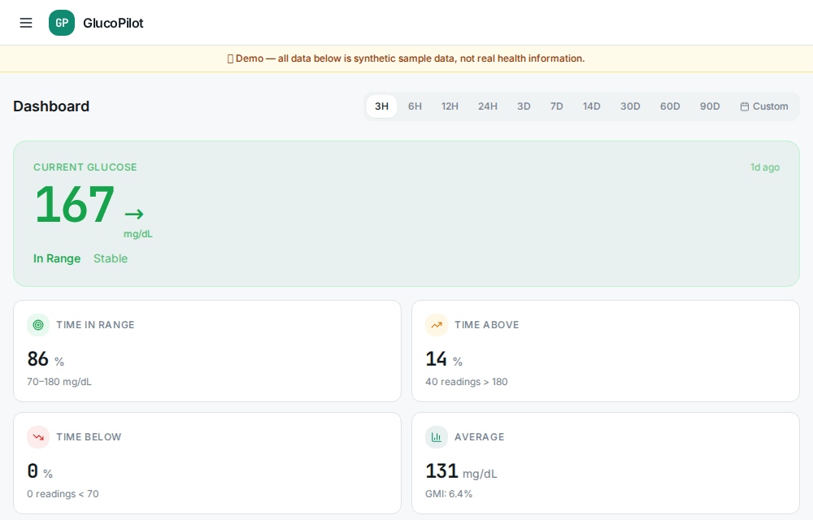

# GlucoPilot

[](https://github.com/Paco5687/GlucoPilot/actions/workflows/ci.yml)
[](LICENSE)

A self-hosted, single-user personal health platform centered on Type 1 diabetes.
It unifies continuous glucose monitoring, insulin pump data, wearables, menstrual
cycle tracking, lab work, and a daily symptom journal into one private app — then
lets you **talk to all of it**.

The centerpiece is a health **Companion**: a chat grounded in your *real* data
that remembers your lived experience and reasons across every domain at once —
glucose, labs, hormones, sleep, symptoms, medications. Around it sit pattern
detection, cross-domain insights, a printable clinician report, and a read-only
login to share with a doctor.

Everything runs on **your** server with **your** API keys. With a local model,
no health data ever leaves the machine.

> **Not a medical device.** GlucoPilot is for personal data exploration and
> education. It does not diagnose, recommend insulin dosing, or control any
> device. Always consult your care team for treatment decisions.



<sub>A walkthrough of the built-in demo — all synthetic sample data, no real health information.</sub>

## What it does

**Data sources** (each connected from the in-app Connections page):

| Source | Data | Notes |
|---|---|---|
| **Dexcom Share** | real-time glucose | the follower feed; near-live |
| **Dexcom API v3** | historical glucose + events | official API, ~1 h delay |
| **Nightscout** | glucose + treatments + profile | if you run one |
| **Tandem Source** | pump boluses / basal / suspends | t:slim X2 & Mobi, via `tconnectsync` |
| **Glooko** | pump treatments | Tandem & Omnipod 5 fallback |
| **Oura Ring** | sleep / readiness / HRV / HR / SpO₂ / temperature | OAuth |
| **Fitbit / Google Health** | steps / heart rate (near-real-time) / sleep / SpO₂ / breathing rate | OAuth; Google Health is Fitbit's successor API |
| **CSV / Base44 export** | bulk import | glucose, treatments, Oura, cycle |

**Talk to your data**

- **Companion** — a health chat grounded in bounded, source-linked Evidence Bundles across glucose, labs, cycle, wearables, medications, and symptoms. It classifies personal observations/calculations/correlations/hypotheses, keeps general medical references and user memory separate, and provides **Show evidence**, **What argues against this?**, and **What changed?** controls. It remembers what you tell it across conversations, keeps multiple threads, and lets you switch between a quick local model and a deeper one. Not a doctor: it surfaces patterns and questions for your care team — never diagnoses or dosing.
- **Overview** — a cross-domain AI health summary that spots connections across your whole picture, not just glucose.
- **Records** — upload lab reports and imaging (PDF/photo); a local vision model extracts values into **per-analyte trend charts**.
- **Visit Report** — a printable 90-day clinical summary (AGP, TIR, per-phase metrics, labs, conditions, medications, symptoms) with an AI "quarter in review" narrative.
- **Share-safe exports** — preview and download role-appropriate private,
  clinician, emergency, deidentified research, or synthetic-demo JSON through
  explicit field allowlists with watermarks, expiration metadata, and secret
  exclusion.
- **Contradiction review** — deterministic checks keep conflicting glucose,
  pump, lab, timing, and revised-source evidence side by side, with attributed
  resolution history and no silent winner.
- **Health hypotheses** — tentative patient, algorithm, or clinician ideas stay
  visibly separate from diagnoses, retain supporting, opposing, and missing
  evidence plus attributable confidence changes, and require clinician review
  before they can be marked confirmed or ruled against.

**Track & analyze**

- **Dashboard** — real-time glucose, TIR/GMI/CV metrics, AGP, treatment timeline, live heart rate, wearable overlays.
- **Explorer** — a zoomable/pannable canvas chart of glucose with insulin, basal bands, and IOB estimation.
- **Patterns** — statistical + AI detection of recurring highs/lows, post-meal spikes, dawn phenomenon, etc.
- **Insights** — cross-domain correlations: glucose × sleep × readiness × activity × cycle.
- **Insulin** — total daily dose, estimated insulin resistance, and correction-response/absorption stats.
- **Cycle** — menstrual phases **inferred automatically from Oura nightly temperature**, tied to glucose/insulin.
- **Wearables** — sleep, activity, HR/HRV, and SpO₂ deep-dives with glucose overlays.
- **Symptom journal** — a nightly check-in (severity, duration, notes) that feeds the Companion, the analytics, and the report.
- **Platform diagnostics** — a privacy-safe operational view of source
  sync/data-through status, import quality, graph and analytics freshness,
  storage, and visible backup age. Source staleness also qualifies Companion
  and Visit Report context without becoming a health finding.

**Your clinical picture**

- **Conditions, medications & allergies, profile** — entered once in Settings, woven into the AI's context and printed on the Visit Report.
- **Provider login** — a read-only second account to share with a clinician.

## Try the demo

Spin up a throwaway instance seeded with realistic **synthetic** data (no login,
no real health info) to explore every feature:

```bash
docker compose -f docker-compose.demo.yml up -d --build
# then open http://localhost:8100
```

The demo auto-seeds ~90 days of glucose, treatments, wearables, cycle, and labs.
Never enable `DEMO_MODE` on an instance holding real data — it skips login.

## Screenshots

| Explorer — zoomable glucose + insulin | Visit Report — printable clinician summary |
|:---:|:---:|
| [](docs/screenshots/explorer.png) | [](docs/screenshots/visit-report.png) |
| **Insights** — cross-domain correlations | **Cycle** — phases inferred from Oura temperature |
| [](docs/screenshots/insights.png) | [](docs/screenshots/cycle.png) |
| **Patterns** — statistical + AI detection | **Records** — lab trends from uploaded reports |
| [](docs/screenshots/patterns.png) | [](docs/screenshots/records.png) |

## Architecture

- **Backend** — FastAPI + SQLite. A generic JSON entity store, session auth with
  a read-only provider role, per-source sync modules, a background scheduler, and
  a pluggable LLM layer (Anthropic API or any local OpenAI-compatible server).
- **Frontend** — React + Vite + Tailwind (shadcn/ui), built and served by the backend.
- **One container**, `docker compose up`. State lives in a single Docker volume.

See [`docs/ARCHITECTURE.md`](docs/ARCHITECTURE.md) for the module map.

## Quick start

### Easiest — run it on your own machine

You only need [Docker](https://docs.docker.com/get-docker/). Then:

```bash
git clone https://github.com/Paco5687/GlucoPilot glucopilot && cd glucopilot
./install.sh
```

The installer checks Docker, generates your config (with a random secret key),
asks a couple of quick questions (port, timezone, an optional AI key), starts the
app, and prints the link — usually `http://localhost:8000`. Open it, create your
login, and finish setup on the **Settings** page. That's the whole thing.

### Server deploy (with a domain + HTTPS)

For a public deployment behind a reverse proxy:

```bash
git clone https://github.com/Paco5687/GlucoPilot glucopilot && cd glucopilot
cp .env.example .env          # set APP_SECRET_KEY and APP_PUBLIC_URL
docker compose up -d          # prebuilt image; add --build to build from source
```

Open your `APP_PUBLIC_URL` and complete the first-run admin setup. Then add
integration credentials and AI provider on the **Settings** page, and connect
sources on **Connections**. See [`docs/DEPLOY.md`](docs/DEPLOY.md) for reverse-proxy
setup and [`docs/LOCAL_MODELS.md`](docs/LOCAL_MODELS.md) for a fully-private AI setup.

Forgot the admin password? `docker compose exec glucopilot python -m server.reset_password`.

## Privacy & safety

**Your data stays yours.** GlucoPilot runs entirely on **your** server. There is
**no telemetry and no phone-home** — the app only talks to the services *you*
connect (CGM, pump, wearables, etc.) and, for AI features, the model provider you
choose. Pick the **local model** and your health data — including uploaded lab
reports and imaging — **never leaves your machine**. Everything lives in one
SQLite database in a Docker volume you control; there is no shared backend and
the maintainers never see your data.

**AI web grounding is optional and off by default.** When you enable it (Settings
→ AI web grounding), the Companion looks up general medical facts from trusted
sources (NIH's MedlinePlus and PubMed, plus an optional web-search provider) and
cites them — **only the general medical topic of your question is sent, never
your records or personal data.** With it off, nothing about your questions leaves
the machine.

It is deliberately **single-user / single-tenant** — one owner per deployment,
so you're the sole custodian. It is **not** built to host other people's health
data multi-tenant; run one instance per person.

> ⚕️ **Not a medical device.** GlucoPilot is for personal data exploration and
> education. It does **not** diagnose, recommend insulin dosing, or control any
> device, and its analytics are estimates — not clinical guidance. Always consult
> your care team for treatment decisions.

Found a security or privacy issue in the code? Please report it privately — see
[`SECURITY.md`](SECURITY.md).

## Third-party integrations

Several connectors use **unofficial** APIs maintained by the diabetes DIY
community (Dexcom Share, Tandem Source via [`tconnectsync`](https://github.com/jwoglom/tconnectsync),
Glooko). These can change without notice; treat them as best-effort. GlucoPilot
is not affiliated with Dexcom, Tandem, Insulet, Glooko, Oura, Fitbit, or Nightscout.

## License

MIT — see [LICENSE](LICENSE).
